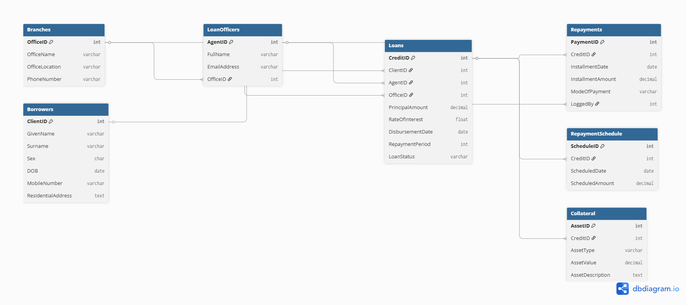

# Bank Loan Management System

A SQL-based loan management and analytics platform designed to manage borrowers, loans, repayments, collateral tracking, and risk monitoring. The system demonstrates database design, transactional processing, audit logging, and business analytics using SQL Server.

## Overview

Financial institutions require reliable systems to manage loans, track repayments, monitor overdue accounts, and maintain audit trails for compliance. This project implements a relational database solution that supports:

* Borrower and loan management
* Repayment tracking
* Collateral management
* Audit logging and compliance monitoring
* Loan performance analytics
* Risk assessment reporting

The platform was developed as part of Advanced Database Management Systems coursework at Arizona State University and demonstrates practical database engineering concepts commonly used in banking and financial services.

---
## Entity Relationship Diagram



## Architecture

### Core Entities

* Branches
* Loan Officers
* Borrowers
* Loans
* Repayments
* Repayment Schedules
* Collateral

The database follows a normalized relational design with primary keys, foreign keys, constraints, stored procedures, functions, triggers, and reporting views.

---

## Key Features

### Loan Management

* Create and manage borrower records
* Track active, closed, and defaulted loans
* Associate loans with branches and loan officers

### Repayment Tracking

* Record loan repayments
* Maintain repayment schedules
* Monitor payment history

### Collateral Management

* Store collateral details
* Track collateral value and type
* Associate assets with loans

### Audit Logging

Implemented database triggers to automatically track:

* INSERT operations
* UPDATE operations
* DELETE operations

Audit logs include:

* Event type
* Timestamp
* Previous values
* Updated values
* User information

### Business Analytics

Created analytical SQL views for:

#### Active Loans by Borrower

Provides visibility into all active loans and associated borrowers.

#### Repayment Summary

Aggregates repayment activity and cash-flow information.

#### Overdue Installments

Identifies borrowers with overdue payments for proactive risk management.

---

## Advanced SQL Components

### Stored Procedure

`sp_InsertRepayment`

Automates insertion of repayment transactions into the system.

### User Defined Function

`fn_CalculateEMI`

Calculates Equated Monthly Installments (EMI) using principal amount, interest rate, and repayment duration.

### Cursor-Based Risk Analysis

Implements borrower risk evaluation by identifying customers with multiple active loans.

---

## Technologies Used

* Microsoft SQL Server 2022
* T-SQL
* Stored Procedures
* User Defined Functions (UDFs)
* Triggers
* Views
* Cursors

---

## Repository Structure

```text
bank-loan-management-system/
│
├── schema.sql
├── sample_data.sql
├── views.sql
├── procedures.sql
├── triggers.sql
│
├── screenshots/
│
├── docs/
│   └── project_report.pdf
│
└── README.md
```

---

## Sample Analytics Questions Answered

* Which borrowers currently have active loans?
* Which repayments were made using cash?
* Which installments are overdue?
* Which borrowers may represent higher lending risk?
* What is the expected EMI for a given loan?

---

## Learning Outcomes

This project strengthened practical experience in:

* Relational database design
* SQL query optimization
* Data integrity enforcement
* Audit and compliance mechanisms
* Financial data modeling
* Analytical reporting

---

## Author

**Siva Madheswaran**

M.S. Data Science, Analytics and Engineering
Arizona State University

GitHub: https://github.com/siva-madheswaran
LinkedIn: https://linkedin.com/in/siva-madheswaran-55478a20b
